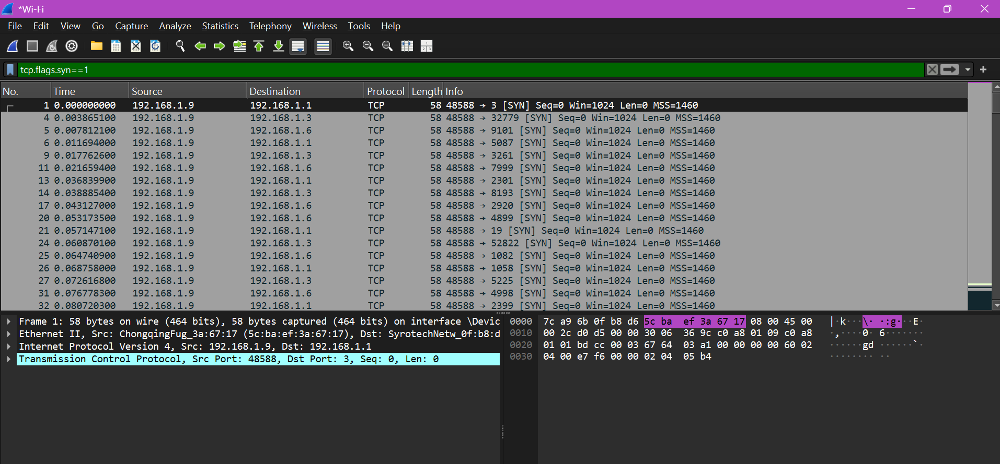
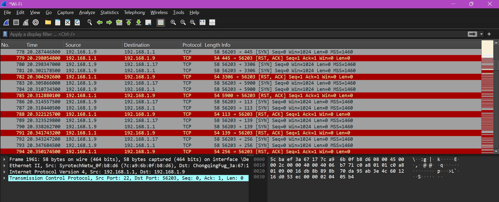
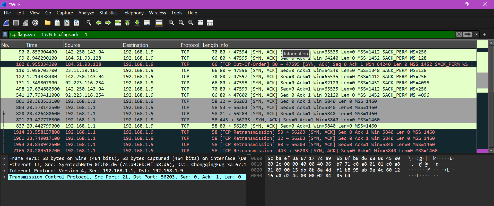
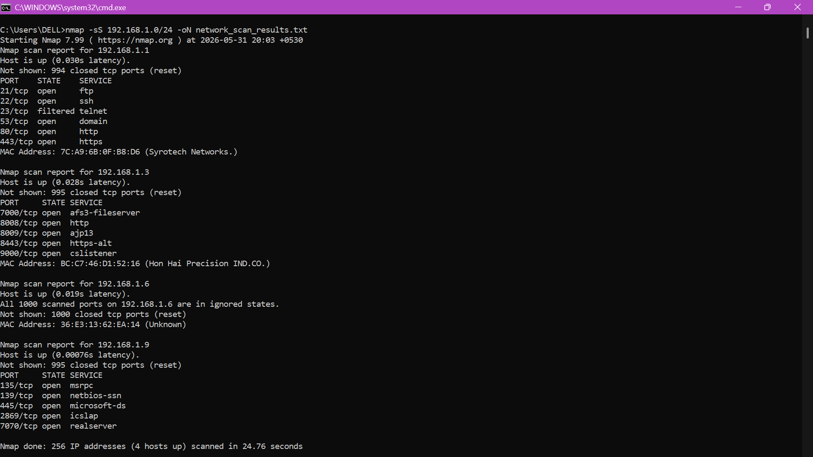

# internship-task1
# Cyber Security Internship - Task 1
## Scan Your Local Network for Open Ports

### 📌 Objective
The goal of this task is to perform **network reconnaissance** by scanning the local network for open ports. This helps in understanding network exposure, identifying services running on devices, and recognizing potential security risks.

---

### 🛠 Tools Used
- **Nmap** (primary tool for port scanning)
- **Wireshark** (optional, for packet-level analysis)

---

### 🚀 Step-by-Step Process

1. **Install Nmap**
   - Download from [https://nmap.org/download.html](https://nmap.org/download.html).
   - Verify installation:
     ```bash
     nmap --version
     ```

2. **Identify Local IP Range**
   - Run `ipconfig` (Windows) or `ifconfig` (Linux/Mac).
   - My active Wi-Fi adapter shows:
     - IPv4 Address: `192.168.1.9`
     - Subnet Mask: `255.255.255.0`
   - Local network range: `192.168.1.0/24`

3. **Run TCP SYN Scan**
   ```bash
   nmap -sS 192.168.1.0/24 -oN network_scan_results.txt
   
This scans all devices in the subnet for open TCP ports.

Results saved in network_scan_results.txt.

4. Analyze Nmap Results

Router (192.168.1.1): FTP, SSH, DNS, HTTP, HTTPS open; Telnet filtered.

Device (192.168.1.3): Multiple web/app services (7000, 8008, 8009, 8443, 9000).

Laptop (192.168.1.9): Windows services (MSRPC, NetBIOS, SMB, ICS, RealServer).

Other devices: Some with all ports closed.

5. Wireshark Capture (Optional)

Captured packets during Nmap scan.

Observed:

SYN → SYN-ACK for open ports (e.g., 21/FTP, 22/SSH).

SYN → RST, ACK for closed ports.

No response for filtered ports (e.g., 23/Telnet).

Screenshots included to demonstrate packet-level behavior.

## Common Services Identified

| Port | Service         | Device             | Notes |
|------|-----------------|--------------------|-------|
| 21   | FTP             | Router             | Insecure, plain-text credentials |
| 22   | SSH             | Router             | Secure remote login |
| 53   | DNS             | Router             | Domain resolution |
| 80   | HTTP            | Router             | Unencrypted web traffic |
| 443  | HTTPS           | Router             | Secure web traffic |
| 135  | MSRPC           | Laptop             | Windows RPC |
| 139  | NetBIOS-SSN     | Laptop             | Legacy file sharing |
| 445  | Microsoft-DS    | Laptop             | SMB file sharing |
| 2869 | ICSLAP          | Laptop             | UPnP/ICS service |
| 7070 | RealServer      | Laptop             | Legacy streaming service |

## ⚠️ Risks Identified

| Port | Service        | Risk                                                                 |
|------|----------------|----------------------------------------------------------------------|
| 21   | FTP            | Transmits credentials in plain text; vulnerable to sniffing attacks  |
| 22   | SSH            | Brute-force login attempts possible                                  |
| 23   | Telnet         | Insecure remote login; sends data unencrypted                        |
| 53   | DNS            | Can be abused for amplification attacks                             |
| 80   | HTTP           | Unencrypted traffic; vulnerable to MITM attacks                      |
| 443  | HTTPS          | Secure, but outdated certificates can be exploited                   |
| 135/139/445 | MSRPC/NetBIOS/SMB | Commonly exploited by malware (e.g., WannaCry, EternalBlue) |
| 2869 | ICSLAP (UPnP)  | Can expose devices to external access                                |
| 7070 | RealServer     | Legacy streaming service; may have unpatched vulnerabilities         |
| 7000 | AFS3 Fileserver| Rarely used; could expose sensitive data                             |
| 8008/8009 | HTTP-Alt/AJP13 | Proxy and app connectors; vulnerable if misconfigured           |
| 8443 | HTTPS-Alt      | Often used for admin consoles; target for brute-force attacks        |
| 9000 | CSListener     | Application service; may expose management interfaces                |
| Unknown Ports (e.g., 6646, 49152) | Could be backdoors or custom services                    |

## 🔬 Wireshark Packet Analysis

To deeply understand and verify Nmap's stealth scanning behavior, a live packet capture was conducted during the scan execution. Below is a forensic breakdown of the network traffic observed across the wire.

### 1. The Stealth Probing Phase (Outbound Traffic)
The scanning host (`192.168.1.9`) initiated the sequence by systematically distributing standard **TCP SYN** packets (`tcp.flags.syn==1`) to various ports across target devices.



* **Behavior:** As visualized in the capture above, Nmap randomizes or rapidly cycles through the ports and target hosts to avoid triggering basic threshold-based network alarms.
* **Handshake Intent:** At this point, no connection has been established; our host is simply asking targets if they are ready to synchronize.

### 2. Identifying Closed Ports (The Reset Response)
When Nmap targets a port that is not hosting any service, the target machine is RFC-compliant and immediately drops the connection attempt. 



* **Analysis:** Our host (`192.168.1.9`) attempts to probe various ports on the gateway and other targets.
* **The Response:** As highlighted in red, the target machine instantly replies with a **`[RST, ACK]`** packet (Reset and Acknowledgment). 
* **Conclusion:** This tells Nmap definitively that the port is **closed**, matching our terminal logs.

### 3. Identifying Open Ports (The Half-Open Success)
The breakthrough of the reconnaissance phase occurs when a target responds favorably. By applying the display filter `tcp.flags.syn == 1 && tcp.flags.ack == 1`, we isolate the open ports:



* **Analysis:** The gateway (`192.168.1.1`) responds with a **`[SYN, ACK]`** from critical service ports such as Port 21 (FTP), Port 22 (SSH), Port 53 (DNS), and Port 80 (HTTP).
* **The "Stealth" Mechanism:** Immediately after receiving these packets, Nmap's raw socket engine sends a **`[RST]`** packet to break the connection before the 3-way handshake finishes. This avoids triggering an application-level login log on the router.

---

## 📸 Technical Verification Artifacts
The execution truth has been verified across both the command line interface and network layer captures. The final output summary below documents the 4 active hosts and their corresponding service states:



📄 Outcome:-

1.Learned how to perform network reconnaissance using Nmap.

2.Understood how to interpret open, closed, and filtered ports.

3.Validated results with Wireshark packet captures.

4.Identified common services and their associated risks.

5.Documented findings and security recommendations.
